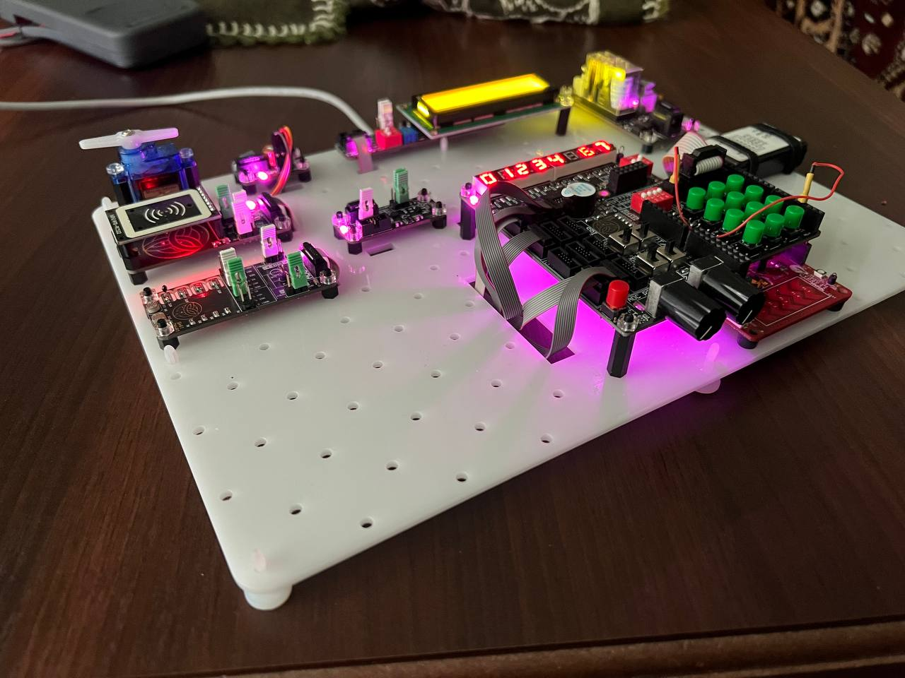
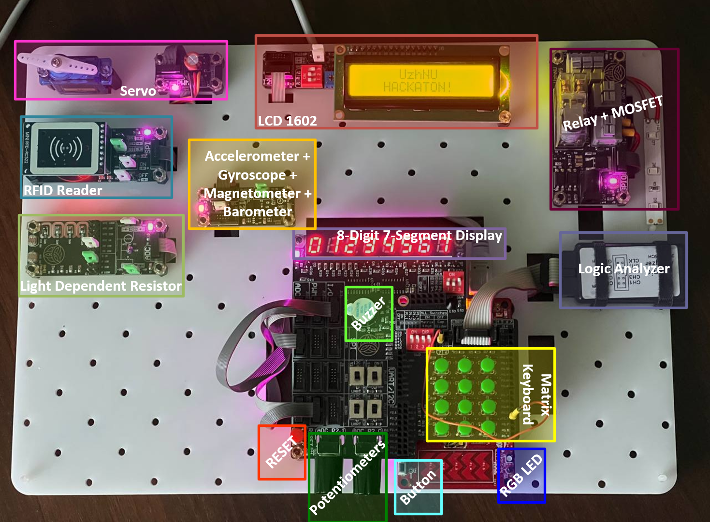

# Smart Safe — UzhNU Hackathon

Embedded firmware for a PSoC 4-based smart safe prototype, developed at the UzhNU Hackathon.

**To learn more about the platform, refer to this [video](https://youtu.be/bs_wQzFeNoM).**

## HW Platform



### Components 



## Hardware

| Component | Interface |
|---|---|
| PSoC 4 (CY8C4xxx) | — |
| 4×3 Matrix Keypad | GPIO |
| 8-digit 7-segment display (74HC595) | SPI |
| LCD 1602 | I²C |
| RFID reader MFRC522 | SPI |
| BMP280 Barometer | I²C |
| LSM6DS3TR-C IMU (Accelerometer + Gyroscope) | I²C |
| LIS3MDL Magnetometer | I²C |
| RGB LED (active-low) | GPIO |
| Servo motor | PWM |
| Buzzer | PWM |
| Relay + MOSFET | GPIO |
| Reed switch | GPIO |

## Keypad Button Map

| Key | Action |
|---|---|
| `0` | RGB LED 7-color pattern |
| `1` | Servo sweep 0 → 90 → 180 → 90° |
| `2` | Buzzer melody playback |
| `3` | Live ADC readout (3 channels) while held |
| `4` | IMU temperature → live accelerometer XYZ |
| `5` | IMU temperature → live gyroscope XYZ |
| `6` | Magnetometer temperature → live mag XYZ |
| `7` | Live barometer (pressure + temperature) while held |
| `8` | Countdown timer on all 8 segments (99999999 → 0) |
| `9` | Live RFID tag scan while held — shows UID on LCD |
| `*` | Relay + MOSFET ON for 2 seconds, then OFF |
| `#` | Live reed switch status while held (Open / Closed) |

Releasing any key returns the LCD to the default splash screen.

## Project Structure

```
Smart_safe.cydsn/
├── main.c              # Application logic — all key actions & live modes
├── lib_*/              # Peripheral driver libraries
├── TopDesign/          # PSoC Creator schematic
└── Smart_safe.cyprj    # PSoC Creator project file
```

## Build

Open `Hackaton.cywrk` in **PSoC Creator 4.x**, select the `Smart_safe` project and click **Build → Build Smart_safe**.
